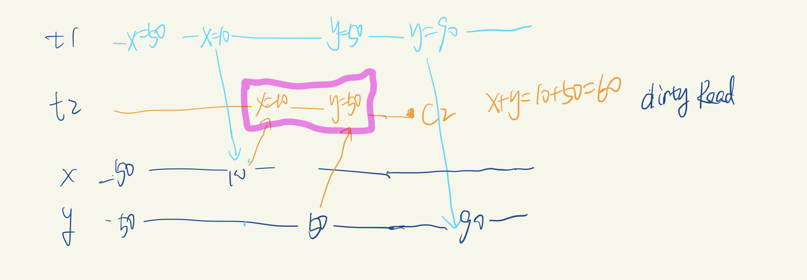
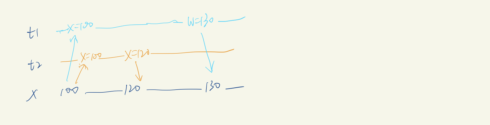
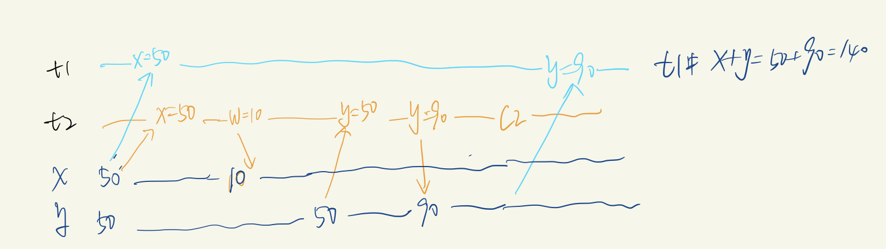
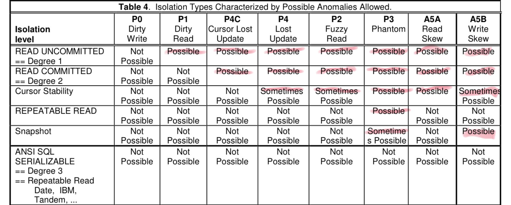
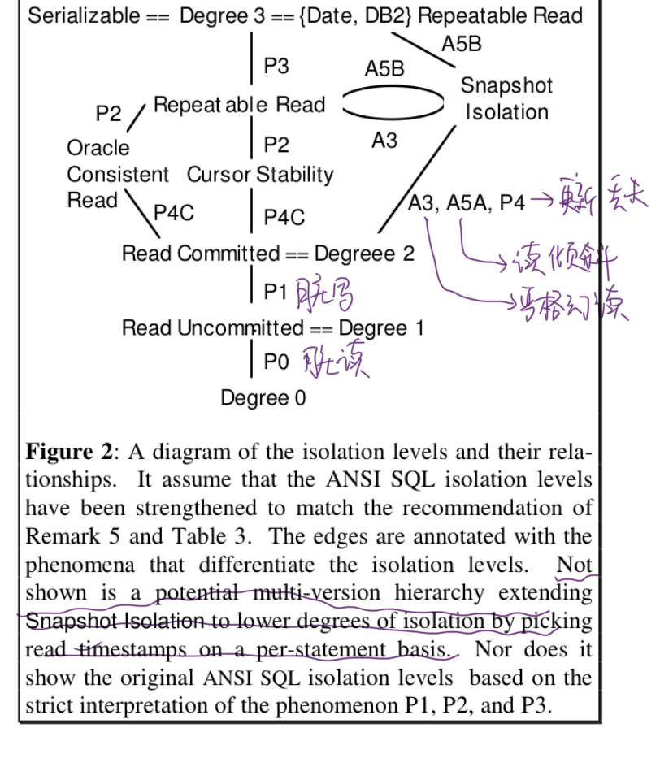

---
title: 分布式-事务
date: 2021-11-14 10:34:03
tags: 分布式
---

本文是《数据密集型应用系统设计》（英文：Designing Data-Intensive Applications) 第7章学习总结。

在总结之前，提问几个问题：

1. 什么是事务
2. 为什么引入事务
3. 事务中最核心的问题是什么？
4. 事务中隔离级别有哪些级别，级别划分依据是什么？
5. 隔离级别解决了哪些问题，哪些没有解决
6. 如何实现这些隔离级别

## 一、事务
### 什么是事务

在应用程序中，将一组数据库的读写组成一个逻辑操作单元；即事务中所有读写是一个执行的整体，整个事务要么成功（提交），要么失败（中止或回滚）。如果失败，应用程序可以安全地重试。

### 为什么引入事务

简化应用层的编程模型：当一组读写中部分写入成功，部分写入失败时，我们需要将成功的进行回滚；如果数据库不引入事务，就需要业务层自己处理。 

如何判断是否需要事务？

> 我们需要确切地理解事务能够提供哪些安全性保证，背后的代价又是什么。 

### 事务提供的安全性保证

事务提供的安全性保证即大家熟悉的ACID。

+ Atomic（原子性）：执行要么全部成功，要么全部失败。在出错时中止事务，并将部分完成的写入全部丢弃。 
+ Consistency(一致性）：这儿的一致性是符合数据的约束条件（比如数据x=y,x+y=100等)
+ Isolation（隔离）：意味着并发执行的多个事务相互隔离，他们不能互相交叉。经典数据库教材中把隔离定义为可串行化。
+ Duration（持久化）：数据持久化

其中AID是数据库自身属性，C是应用层属性，AID来保证C。

## 二、隔离级别

### 2.1 什么时候需要隔离？

如果两个事务操作的是不同的数据，即不存在数据依赖关系，那么就可以安全地并行。

只有出现某个事务修改数据而另外一个事务同时读取该数据，或者两个事务同时修改相同数据时，才会引起并发问题。

### 2.2 隔离级别的定义

ANSI/ISO SQL-92中定义了四种隔离级别Read-Commited, Repeatable Read, Snapshot Isolation, Seriable。这些隔离级别是通过经典的序列化定义和三种被禁止的子序列来定义的。三种被禁止的子序列是Dirty Read, Non-repeatable Read 和 phantom(幻象）。

隔离级别也是与lock有关的。

### 2.3 异常现象（异常子序列）
这些异常现象将会用如下格式进行详细描述：
 
 + 问题的文字描述
 + 问题的序列化表示
 + 问题的例子
 + 问题的解决方案

 
关于锁的解释
 
 1. long-duration vs short duration
	+ 长期锁是在加锁以后，直到事务结束或回滚才释放锁
	+ 短期锁是在动作结束以后，就立即释放锁
 2. predict  vs ？？

 	+ predict lock是针对一个查询条件加锁
 	+ 行锁是针对特定一行记录加锁
 

#### 脏写 Dirty Write P0
1. 问题的文字描述：一个正在进行的事务覆盖了另外一个事务尚未提交的写入。
2. 问题的序列化表示：W1(x)...W2(x) ... (c1 or a1)
3. 问题的解决办法：对写入加一个long-duration write lock。
4. 说明：
	+ Dirty write是ANSI/ISO SQL-92中没有提到的，但是需要避免，是基础。
	+ 如果有脏写，那么会没有办法回滚，也可能影响数据约束（x=y or x+y=100)
5. 举例：Suppose T1 writes x=y=1 and T2 writes x=y=2, the following history violates the integrity constraint.

#### 脏读 Dirty Read P1

1. 问题的文字描述：一个正在进行的事务读取了另外一个事务未提交的写入。
2. 问题的序列化表示：W1(x)..R2(x) ..(c1 or a1)
3. 问题的解决办法：加入一个short-duration read lock。
	+ 写是long-duration write lock, 读是short-duration read lock，当正在发生写入的事务占有锁时，读取的事务因为没有办法获得读锁，只能等待。 
	+ 注明：[1](http://arxiv.org/pdf/cs/0701157.pdf)中使用读锁来实现，但是在最新的数据库中数据库维护新旧两个取值，事务提交之前读取旧值；仅当写事务提交以后，才会切换到读取新值。
4. 说明：
	+ 解决该问题的隔离级别就是 Read-Commited（读-提交） 隔离级别
5. 举例：
	+ 序列化：H1: r1[x=50]w1[x=10]r2[x=10]r2[y=50]c2 r1[y=50]w1[y=90]c1
	+ 如下图所示 t2中 x+y=60，其中x=10是脏读，

#### 不可重复读 unrepeatable-read P2

1. 问题的文字描述：事务在不同的时间点看到不同值。事务T2修改了之前事务T1读过的数据，不管T1、T2是提交还是回滚，就认为是nonrepeatable-read
2. 问题的序列化表示：R1(x)..W2(x)..(c1 or a1)
3. 问题的解决办法：snapshot isolation，多版本
4. 说明：不可重复读实际是 读倾斜的x等于y的一个特例
5. 举例：因为不可重复读可以看做是读倾斜x等于y的一个特例，可以去看 读倾斜的例子。

#### 幻象 phantom P3

1. 问题的文字描述：

	事务T1读取一组数据集合满足条件<search condition>。事务T2创建了满足T1中<search condition>的数据集合并提交，那么T1重复读取<search condition>时，将会获取到跟之前不同的数据
	
2. 问题的序列化表示：R1(P)... W2(y in P)...(c1 or a1)
3. 问题的解决办法：采用区间范围锁 index-range lock，又叫next-key lock
4. 说明：
	+ Nonrepeatable和幻象的区别 一个单个对象，一个是多个对象

##### 严格意义的幻象 A3

1. 问题的序列化表示：R1(p)..W2(y in p)..c2..r1(p)...c1
2. 与P3相比更加严格，有一次T1的读取操作。
3. 问题解决办法：使用snapshot isolation即可解决

#### 更新丢失 Losst update P4

1. 问题的文字描述：事务T2对X的修改被事务T1的修改覆盖。之后事务T1提交，从外界看来，T1对X的修改丢失
2. 问题的序列化表示：R1(x)..W2(x)..W1(x)..C1
3. 问题的解决办法：snapshot isolation，多版本
4. 举例：
	+ 序列化是 H4: r1[x=100]r2[x=100]w2[x=120 c2 w1 [x=130] c1
	+ 预期是从100经过+20，+30，最后取值是150；实际是130。如图所示 

#### 更新丢失 Cursor Lost update P4C

P4C is a variation of the Lost Update phenomenon that involves a SQL cursor. In the history below, let rc(x) represent a read of the data item x under the cursor, and wc(x) a write of the data item x under the cursor. If we allow another transaction T2 to write to x in between the read-cursor and write-cursor actions of T1, then its update will be lost.

序列化表示：P4C: rc1[x]..w2[x] ..w1[x] ..c1 

### 数据不一致 data item constraint violation A5

1. 问题的文字描述：两个数据X和Y满足某些限制，可能有以下异常情况出现：
	+ A5A Read Skew: 假设T1读取X，之后T2更新x和y到了新的取值，并提交；之后T1读取y，则x和y的限制被打破。
	+  A5B Write Skew: 假设T1读取X和Y，之后T2读取X和Y，并写入X，然后提交；之后T1 写入Y，那么存在X和Y的限制被打破的可能

#### A5A Read Skew:

1. 序列化表示：A5A: R1(x)..W2(x)..W2(y)..C2 ...R1(y) .. (c1 or a1)
2. 举例：
			以银行转账为例，初始化x=y=50，从x转走40到y，最终预期是x=10,y=90。
			出现脏读时，其读取数据是 r1[x=5]r2[x=50]w2[x=10]r2[y=50]w2[y=90]c2r1[y=90]c1
			数据如图所示，t1中x+y=140不满足100的限制。 

#### A5B Write Skew:
1.  序列化表示：A5B：R1(x)..R2(y)..W1(y)..W2(x)..(c1 and c2 occur)
2. 举例：

### 2.4 隔离级别

可以通过刻画他们禁止的异常情况来刻画隔离级别

他们之间的关系如下图所示 

我们可以通过他们允许的非序列化历史来比较隔离级别：

+ L1 is weaker than L2 if L1 permits non-serializable histories that L2 does not, and every non-serializable history under L2 is also a non-serializable history under L1. We write L1 << L2.
+ L1 and L2 are equivalent if the sets of non-serializable histories permitted by them both are identical. We write L1 == L2
+ L1 and L2 may also be incomparable. If L1 permits a non-serializable history that L2 does not, and vice-versa, then L1 is not weaker than L2, but L2 is also not weaker than L1. We write L1 <> L2.

#### 结论1:
我们可以得到 
> Degree 0 (everything goes) << Read Uncommitted << Read Committed << Cursor Stability << Repeatable Read << Serializable.

重点解释一下 Cursor Stability，Cursor Stability是扩展Read Commited锁行为。//TODO 待补充

#### 结论2：

> Read commited << snapshot isolation

> ANOMALY Serializable << Snapshot isolation

> repeatable read <>  snapshot isolation 这两个是不可比较的。

许多应用通过使用cursor stability 或 oracle's read consistency isolation 来避免锁竞争。对于这些应用而言，使用Snapshot Isolation会更好：

+ 避免lost update
+ 严格意义的幻象(如上面所说明的A3，但不能定义更广的P3）
+ 从不阻塞只读的事务，读取不会阻塞更新

 
 
 
 ## 参考文章
 1. Hal Berenson, Philip A. Bernstein, Jim N. Gray, et al.: “[A Critique of ANSI SQL Isolation Levels,](http://research.microsoft.com/pubs/69541/tr-95-51.pdf)” at ACM International Conference on Management of Data (SIG‐ MOD), May 1995
 2. [A Critique of ANSI SQL Isolation Levels 解释](https://blog.acolyer.org/2016/02/24/a-critique-of-ansi-sql-isolation-levels/)
 3. [A Critique of ANSI SQL Isolation Levels 阅读笔记](https://zhuanlan.zhihu.com/p/187597966)
 4. 数据密集型应用系统设计 chapter 7 事务